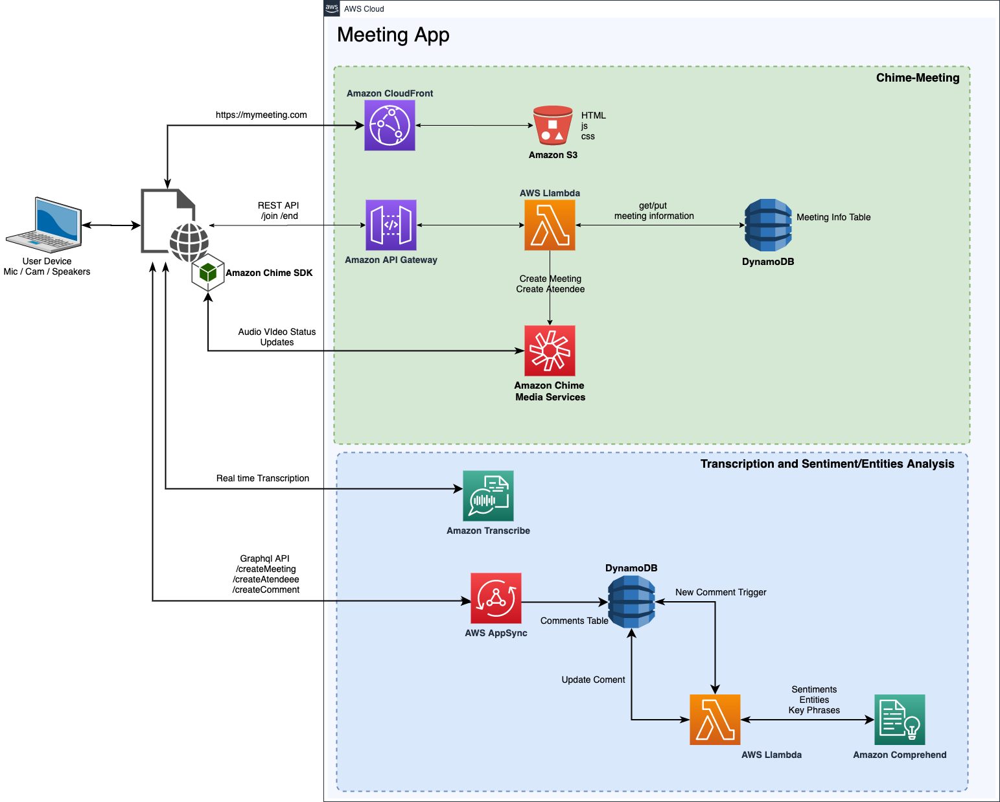
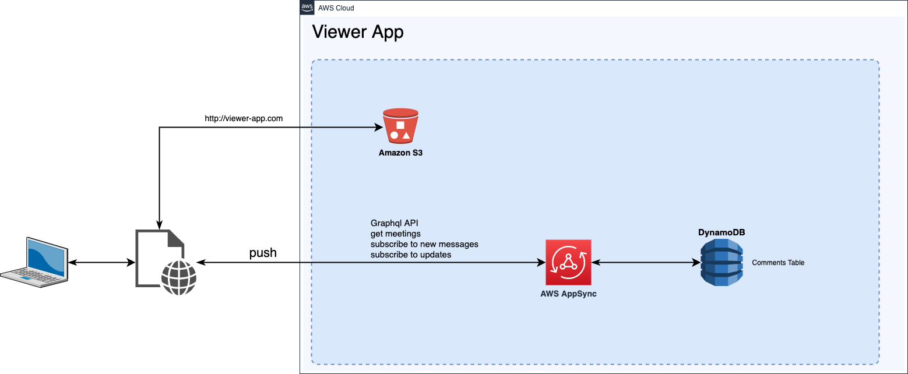
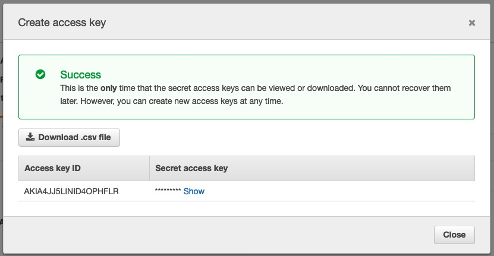
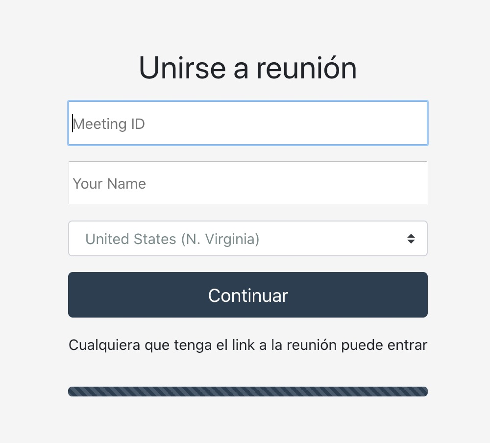
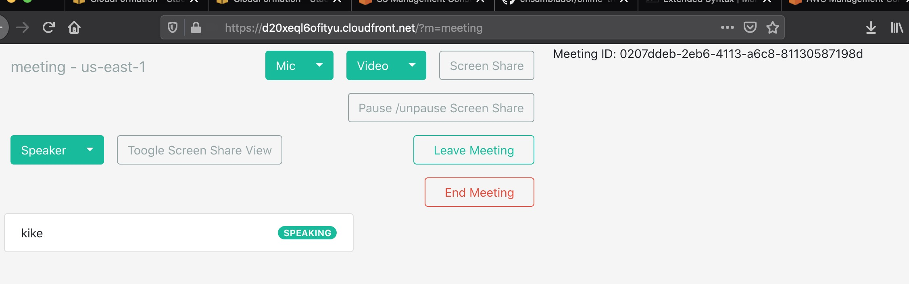
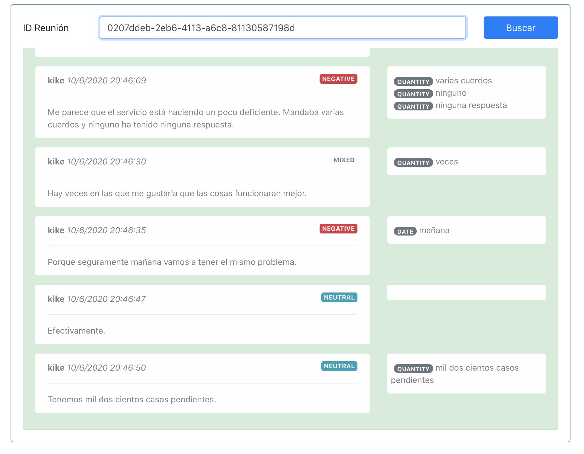

# Chime-trascribe-comprehend-demo

Esta es una pequeña demostración de las capacidades que se pueden agregar a una reunión de Chime Utilizando servicio de inteligencia artificial. Lo que vamos hacer es:

1. Generar una reunión en línea utilizando Chime Services. Para eso utilizaremos una función Lambda y una base de datos DynamoDB, en conjunto con ApiGateway que servirá como endpoint para ingresar / salir de una nueva reunión. 

2. A continuación, durante el transcurso de la reunión, utilizaremos Amazon Transcribe para transcribir en línea el audio de la conversación a texto, que será almacenado en una Tabla DynamoDB.

3. Una vez almacenado, utilizamos Amazon Comprehend para extraer entidades, sentimientos y palabras claves de la conversación.

Cabe destacar que una vez almacenado el texto, Esto puede ser extensible y accionable utilizando otros servicios por ejemplo Amazon Lex, Amazon Simple Email Service, Amazon Pinpoint, Amazon Translate etc. Sólo se requiere hacer uso del desencadenador que se activa en el paso 3 ante cada comentario.

---

# Arquitectura


## Aplicación Meeting Web

La arquitectura también se puede dividir en tres partes. La primera consiste en la reunión web propiamente tal, en la parte superior del diagrama. La aplicación está hosteada en un bucket y servida utilizando Cloudfront (donde aprovechamos el uso de certificado SSL de Cloudfront para utilizar HTTPS). 
A través de un API endpoint se solicita el ingreso a una nueva reunión, luego, una funcion lambda se encarga de generar la sala en Chime y guardar esta información en  una tabla.

La aplicación está basada en el demo serverless de Amazon Chime [Github Repo](https://github.com/aws/amazon-chime-sdk-js/tree/master/demos/serverless). En este caso hemos separado front end de la aplicación para poder modificarlo.



Para la transcripción de audio se utiliza el micrófono de cada asistente en la reunión, este audio es convertido a texto utilizando Amazon Transcribe en modalidad streaming con un websocket. La respuesta es insertada utilizando un endpoint de AppSync para poder ver las actualizaciones en tiempo real de las conversaciones. Éste último inserta un nuevo registro en la tabla comentarios.

Tras bambalinas, un desencadenador de la tabla de comentarios activa una función lambda que se encarga de invocar Amazon Comprehend y así  extraer las entidades, palabras clave y sentimiento de cada uno de los comentarios. Finalmente esta función actualiza la tabla.

## Aplicacion de Visualización

Consiste en una aplicación simple para poder visualizar los comentarios y las características extraídas con comprehend.



La aplicación de visualización también se encuentra hosteada en un bucket y aprovecha el endpoint AppSync/GraphQL para suscribirse a las actualizaciones de la reunión. 

<br><br><br><br>

---
# Implementación

### Pre-requisitos

1. instalar y configurar [aws cli](https://docs.aws.amazon.com/cli/latest/userguide/install-cliv2.html)
1. [SAM cli](https://docs.aws.amazon.com/serverless-application-model/latest/developerguide/serverless-sam-cli-install.html)
2. [Amplify cli](https://github.com/aws-amplify/amplify-cli#install-the-cli)
3. Una cuenta de AWS
4. [yarn](https://yarnpkg.com/)
5. Se recomienda tener algo de conocimiento en Javascript y Nodejs, pero no son necesarios para desplegar este proyecto.


La implementación ha sido dividida en 2 partes. Vamos paso a paso en cada una de ellas, con la idea de ir entendiendo lo que ocurre. Éstas instrucciones están preparadas para un OSX (bash, zsh). No obastante para windows los comandos son los equivalentes en cmd.


<br><br><br>

## Parte I: Backend Chime Meeting

<br><br>

Primero clonamos el repositorio del proyecto:

```console
git clone https://github.com/ensamblador/chime-transcribe-comprehend-demo.git
cd chime-transcribe-comprehend-demo
```


Para el backend debemos contar previamente con un bucket disponible para despliegue, en caso de no estar creado se puede utilizar el comando make bucket:

`aws s3 mb <BUCKET-NAME>`

Nota: si quiere restringir a una región o profile (en caso de tener varios profiles cargados)

`aws s3 mb <BUCKET-NAME> --profile <PROFILE-NAME> --region <REGION>`

Utilizamos este bucket en el despligue. Vamos a la carpeta desplegamos el backend de chime usando sam cli:

```console
aws s3 mb s3://chime-meeting-deploy-bucket
sam deploy --stack-name chime-intelligent-meeting-backend-epsilon --s3-bucket chime-meeting-deploy-bucket --capabilities CAPABILITY_IAM --region us-east-1
```

Una vez terminado el despligue de cloudformation, capturamos el endpoint url en un archivo (para el uso en meeting web). Ejecute estos comandos tal cual para capturar esa variable y almacenarla en el archivo.

```console
aws cloudformation describe-stacks --stack-name chime-intelligent-meeting-backend-epsilon --region us-east-1 --query 'Stacks[0].Outputs[?OutputKey==`ApiURL`].OutputValue' --output text --profile default | read APIURL
echo "export const CHIME_BACKEND='$APIURL'" > ./src/chime-api-url.js
cat ./src/chime-api-url.js
```
Deberíamos esperar una respuesta como esta del archivo chime-api-url.js
```javascript
export const CHIME_BACKEND='https://XXXXXXX.execute-api.us-east-1.amazonaws.com/Prod/'
```

Que es el endpoint para interactuar con la reunión Chime. A través de este endpoint se pueden generar salas de reuniones, identificar asistente y manejar (a través de Chime Media Services) los streams de audio y video.

<br><br><br><br><br><br>

## Parte II: Web Meeting App

<br><br>

## Obtener credenciales de invocación de transcribe

Para poder ejecutar la transcripción, necesitaremos de usuario para la generación de transcripción en línea. Para ello seguiremos los siguientes pasos:

1. Acceda a la consola IAM y cree un usuario IAM con sólo acceso programático
2. A este usuario agregue una política tipo inline con el siguiente estamento:
```json
{
    "Version": "2012-10-17",
    "Statement": [
        {
            "Sid": "transcribestreaming",
            "Effect": "Allow",
            "Action": "transcribe:StartStreamTranscriptionWebSocket",
            "Resource": "*"
        }
    ]
}
```
esto le permitirá al usuario realizar una transcripción en streaming (y sólo eso).

3. En security credentials haga click en el boton "create access key".
4. Copie los valores de access_key y secret_key en el archivo  [src/transcribe_credentials.js](src/transcribe_credentials.js)



<br><br><br>

## Despliegue de la Web App
<br>

Finalmente, y utilizando amplify-cli podremos desplegar los recursos de nube necesarios y aplicacón web de forma sencilla. La aplicación está compuesta de:

* Api: GraphQL api para la inserción de comentarios transcritos y suscripción de actualizaciones de comentarios.
* Function: Funcion lambda que se gatilla cuando se inserta un nuevo comentario, esta funcion extrae las entidades y sentimientos de los comentarios usando Amazon Comprehend.
* Trigger: El trigger que gatilla la ejecución de la función.

NOTA: Considere que un antivirus podría bloquear las acciones de Amplify cli. Si se encuentra con este problema, desactívelo temporalmente.

```console
amplify init
```

Elija nombre de ambiente, editor de preferencia, el profile de aws. Una vez terminada la inicialización puede ejecutar `amplify status` para ver el estado del proyecto. La salida deberá ser algo como esto:

```console
| Category | Resource name                 | Operation | Provider plugin   |
| -------- | ----------------------------- | --------- | ----------------- |
| Trigger  | DynamoInsertTrigger           | Create    | awscloudformation |
| Api      | transcribeviewer              | Create    | awscloudformation |
| Function | appsyncautocomprehendfunction | Create    | awscloudformation |
```

A continuación puede ejecutar los siguientes comandos que crearán los recursos en AWS preconfigurados (Trigger, Api, Funcion) y los nuevos recursos (hosting). Finalmente con `yarn install` instalamos los paquetes de la aplicación y con `amplify publish` lo publicamos para acceder al sitio desde el navegador.

```console
amplify hosting add
```

Después de `amplify hosting add` elija ` PROD (S3 with CloudFront using HTTPS)` y el nombre del hosting bucket puede ser el propuesto por amplify sin problemas.

Para actualizar los valores por defecto de la distribución cloudfront actualizamos el hosting. Los navegadores requieren HTTPS para poder entregar acceso a los dispositivos multimedia, la forma más fácil es utilizar el certificado de cloudfront.net, sólo usamos cloudfront para que provea el certificado y la conexión segura HTTPS.

```console
amplify hosting update
```
```
? hosting bucket name transcribeviewer-20200922014710-hostingbucket
? Specify the section to configure CloudFront
? Remove CloudFront from hosting No
? default object to return from origin index.html
? Default TTL for the default cache behavior 0
? Max TTL for the default cache behavior 0
? Min TTL for the default cache behavior 0
? Configure Custom Error Responses No
? Specify the section to configure exit
```
Ahora está listo para desplegar el sitio web.

```console
yarn install
amplify publish
```

Nota: yarn podría arrojar unos warnings relacionados a "unmet peer dependency" no se preocupe.


**Después de `amplify publish` elija _`no`_ cuando consulta por la generación del código graphql**

```console
Do you want to generate code for your newly created GraphQL API (Y/n) n
```

Al finalizar el despliegue accedemos al sitio web
```console
Hosting endpoint: https://XXXXXXXXXXX.cloudfront.net
```

Nota: Si el link generado de cloudfront le genera un error de permiso web, quiere decir que la actualización del sitio web desde el bucket aún está en curso. Espere unos minutos y vuelva a intentarlo.

<br><br><br>


## Prueba de la Demo.

Para probar la demo accedemos a la web meeting app, una vez ingresados utilizamos Meeting ID que muestra la pantalla. 






El Id de la reunión lo utilizamos en la viewer app para observar la transcripción y entidades en tiempo real. Puede compartir el link con otro usuario para agregar más asistentes a la reunión.

<br><br><br>

## Viendo la transcripción y comprensión en tiempo real

<br>

Para ver la transcripción accedemos en otra ventana a https://XXXXXXXXXXX.cloudfront.net/viewer (misma url base de la reunión pero agregando /viewer) en esta parte buscamos el ID de la reunión y nos mostrará la bitácora.




Se observa que después de cada bloque de audio se inserta la transcripción correspondiente y, unos segundos después, las características obtenidas con comprehend. Éste último es capaz de identificar fechas, cantidades, organizaciones, personas y también los sentimientos de los comentarios.

Si bien es cierto el demo es simple, se puede extender utilizando la base de datos de comentarios para realizar analítica posterior de las interacciones o generación de acciones inmediatas en base a ciertos patrones que podrían surgin en una reunión.

---
<br><br>

# Limpieza

La limpieza basicamente es eliminar los stacks de cada aplicación. Primero el backend (debe reeemplazar el stack name por el que utilizó) 

```console
aws cloudformation delete-stack --stack-name $STACK_NAME --region $REGION --profile $PROFILE
```
Además, se debe eliminar el bucket para deploy (el nombre de bucket es el que se utilizó en paso I)
```console
aws s3 rb --force s3://$DEPLOY_BUCKET --profile $PROFILE
```

En el proyecto amplify eliminamos los recursos cloud utilizando `amplify delete`
```console
amplify delete
```

Nota: De forma manual se eliminan los buckets utilizados para hosting. Dada la forma de despliegue, no serán borrados cuando se eliminan los recursos ya que no estan vacíos. Si no recordamos los nombres los podemos buscar  (amplify propone nombres que contienen la fecha de creación)

```console
aws s3 ls --profile default | grep transcribeviewer
2020-06-10 14:27:38 transcribeviewer-20200610142441-hostingbucket-epsilon
```
Nota: `grep transcribeviewer` busca buckets con ese patrón en el nombre, se debe revisar si el bucket es el creado con amplify dependerá de la fecha de creación de esos buckets.

Eliminamos ese bucket

```console
aws s3 rb --force s3://transcribeviewer-20200610142441-hostingbucket-epsilon
```

Con eso terminamos la limpieza de los recursos cloud.


Enjoy!